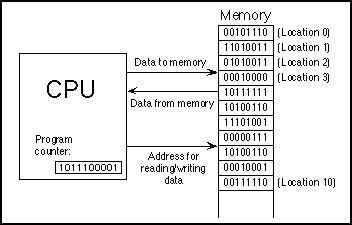

1.1. The Fetch and Execute Cycle: Machine Language
--------------------------------------------------

A computer is a complex system consisting of many different
components. But at the heart -- or the brain, if you want -- of the
computer is a single component that does the actual computing. This is
the ``Central Processing Unit``, or ``CPU``. In a modern desktop computer, the
CPU is a single "chip" on the order of one square inch in size. The
job of the CPU is to execute programs.

A program is simply ``a list of unambiguous instructions`` meant to be
followed mechanically by a computer. A computer is built to carry out
instructions that are written in a very simple type of language called
machine language. Each type of computer has its own machine language,
and the computer can directly execute a program only if the program is
expressed in that language. (It can execute programs written in other
languages if they are first translated into machine language.)

When the CPU executes a program, that program is stored in the
computer's main memory (also called the ``RAM`` or ``random access memory``).
In addition to the program, memory can also hold data that is being
used or processed by the program. Main memory consists of a sequence
of locations. These locations are numbered, and the sequence number of
a location is called its ``address``. An address provides a way of picking
out one particular piece of information from among the millions stored
in memory. When the CPU needs to access the program instruction or
data in a particular location, it sends the address of that
information as a signal to the memory; the memory responds by sending
back the data contained in the specified location. The CPU can also
store information in memory by specifying the information to be stored
and the address of the location where it is to be stored.

On the level of machine language, the operation of the CPU is fairly
straightforward (although it is very complicated in detail). The CPU
executes a program that is stored as a sequence of machine language
instructions in main memory. It does this by repeatedly reading, or
fetching, an instruction from memory and then carrying out,
or executing, that instruction. This process -- fetch an instruction,
execute it, fetch another instruction, execute it, and so on forever
-- is called the ``fetch-and-execute cycle``. With one exception, which
will be covered in the :doc:`next section<s2>`, this is all that the 
CPU ever does.

The details of the fetch-and-execute cycle are not terribly important,
but there are a few basic things you should know. The CPU contains a
few internal ``registers``, which are small memory units capable of holding
a single number or machine language instruction. The CPU uses one of
these registers -- the ``program counter``, or PC -- to keep track of
where it is in the program it is executing. The PC stores the address
of the next instruction that the CPU should execute. At the beginning
of each fetch-and-execute cycle, the CPU checks the PC to see which
instruction it should fetch. During the course of the fetch-and-
execute cycle, the number in the PC is updated to indicate the
instruction that is to be executed in the next cycle. (Usually, but
not always, this is just the instruction that sequentially follows the
current instruction in the program.)

A computer executes machine language programs mechanically -- that is
without understanding them or thinking about them -- simply because of
the way it is physically put together. This is not an easy concept. A
computer is a machine built of millions of tiny switches called
transistors, which have the property that they can be wired together
in such a way that an output from one switch can turn another switch
on or off. As a computer computes, these switches turn each other on
or off in a pattern determined both by the way they are wired together
and by the program that the computer is executing.

Machine language instructions are expressed as ``binary`` numbers. A
binary number is made up of just two possible digits, zero and one.
So, a machine language instruction is just a sequence of zeros and
ones. Each particular sequence encodes some particular instruction.
The data that the computer manipulates is also encoded as binary
numbers. A computer can work directly with binary numbers because
switches can readily represent such numbers: Turn the switch on to
represent a one; turn it off to represent a zero. Machine language
instructions are stored in memory as patterns of switches turned on or
off. When a machine language instruction is loaded into the CPU, all
that happens is that certain switches are turned on or off in the
pattern that encodes that particular instruction. The CPU is built to
respond to this pattern by executing the instruction it encodes; it
does this simply because of the way all the other switches in the CPU
are wired together.

So, you should understand this much about how computers work: Main
memory holds machine language programs and data. These are encoded as
binary numbers. The CPU fetches machine language instructions from
memory one after another and executes them. It does this mechanically,
without thinking about or understanding what it does -- and therefore
the program it executes must be perfect, complete in all details, and
unambiguous because the CPU can do nothing but execute it exactly as
written. Here is a schematic view of this first-stage understanding of
the computer:

