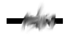

13.1. Images and Resources
--------------------------

We have seen how to use the Graphics class to draw on a GUI component
that is visible on the computer's screen. Often, however, it is useful
to be able to create a drawing **off-screen**, in the computer's
memory. It is also important to be able to work with images that are
stored in files.

To a computer, an image is just a set of numbers. The numbers specify
the color of each pixel in the image. The numbers that represent the
image on the computer's screen are stored in a part of memory called a
frame buffer. Many times each second, the computer's video card reads
the data in the frame buffer and colors each pixel on the screen
according to that data. Whenever the computer needs to make some
change to the screen, it writes some new numbers to the frame buffer,
and the change appears on the screen a fraction of a second later, the
next time the screen is redrawn by the video card.

Since it's just a set of numbers, the data for an image doesn't have
to be stored in a frame buffer. It can be stored elsewhere in the
computer's memory. It can be stored in a file on the computer's hard
disk. Just like any other data file, an image file can be downloaded
over the Internet. Java includes standard classes and subroutines that
can be used to copy image data from one part of memory to another and
to get data from an image file and use it to display the image on the
screen.

13.1.1 Images and BufferedImages
~~~~~~~~~~~~~~~~~~~~~~~~~~~~~~~~

The class ``java.awt.Image`` represents an image stored in the computer's
memory. There are two fundamentally different types of Image. One kind
represents an image read from a source outside the program, such as
from a file on the computer's hard disk or over a network connection.
The second type is an image created by the program. I refer to this
second type as an off-screen canvas. An ``off-screen canvas`` is a region
of the computer's memory that can be used as a drawing surface. It is
possible to draw to an off-screen image using the same Graphics class
that is used for drawing on the screen.

An Image of either type can be copied onto the screen (or onto an off-
screen canvas) using methods that are defined in the Graphics class.
This is most commonly done in the ``paintComponent()`` method of a
JComponent. Suppose that ``g`` is the Graphics object that is provided as
a parameter to the ``paintComponent()`` method, and that ``img`` is of type
Image. Then the statement

.. code-block:: java

    g.drawImage(img, x, y, this);

will draw the image ``img`` in a rectangular area in the component. The
integer-valued parameters ``x`` and ``y`` give the position of the upper-left
corner of the rectangle in which the image is displayed, and the
rectangle is just large enough to hold the image. The fourth
parameter, this, is the special variable from
:doc:`Subsection 5.6.1</5/s6`  that
refers to the JComponent itself. This parameter is there for technical
reasons having to do with the funny way Java treats image files. For
most applications, you don't need to understand this, but here is how
it works: ``g.drawImage()`` does not actually draw the image in all cases.
It is possible that the complete image is not available when this
method is called; this can happen, for example, if the image has to be
read from a file. In that case, ``g.drawImage()`` merely **initiates** the
drawing of the image and returns immediately. Pieces of the image are
drawn later, asynchronously, as they become available. The question
is, **how** do they get drawn? That's where the fourth parameter to
the ``drawImage`` method comes in. The fourth parameter is something
called an ``ImageObserver``. When a piece of the image becomes available
to be drawn, the system will inform the ``ImageObserver``, and that piece
of the image will appear on the screen. Any ``JComponent`` object can act
as an ``ImageObserver``. The ``drawImage`` method returns a boolean value to
indicate whether the image has actually been drawn or not when the
method returns. When drawing an image that you have created in the
computer's memory, or one that you are sure has already been
completely loaded, you can set the ``ImageObserver`` parameter to null.
This is true in particular for any ``BufferedImage``

There are a few useful variations of the ``drawImage()`` method. For
example, it is possible to scale the image as it is drawn to a
specified width and height. This is done with the command

.. code-block:: java

    g.drawImage(img, x, y, width, height, imageObserver);

The parameters width and height give the size of the rectangle in
which the image is displayed. Another version makes it possible to
draw just part of the image. In the command:

.. code-block:: java

    g.drawImage(img, dest_x1, dest_y1, dest_x2, dest_y2,
                     source_x1, source_y1, source_x2, source_y2, imageObserver);

the integers ``source_x1``, ``source_y1``, ``source_x2``, and ``source_y2``
specify the top-left and bottom-right corners of a rectangular region in the
source image. The integers ``dest_x1``, ``dest_y1``, ``dest_x2``, and
``dest_y2``
specify the corners of a region in the destination graphics context.
The specified rectangle in the image is drawn, with scaling if
necessary, to the specified rectangle in the graphics context. For an
example in which this is useful, consider a card game that needs to
display 52 different cards. Dealing with 52 image files can be
cumbersome and inefficient, especially for downloading over the
Internet. So, all the cards might be put into a single image:

.. image:: img/cards.png
   :width: 513
   :height: 307

(This image is from the Gnome desktop project,`<http://www.gnome.org>`_,
and is shown here much smaller than its actual size.) Now just one
Image object is needed. Drawing one card means drawing a rectangular
region from the image. This technique is used in a variation of the
sample program :download:`HighLowGUI.java <../source/HighLowGUI.java`
from `Subsection6.7.6`_. In the original version, the cards are represented
by textual descriptions such as "King of Hearts." In the new version,
:download:`HighLowWithImages.java <../source/HighLowWithImages.java`, the
cards are shown as images. Here is an applet version of the program:

.. applet:: applets/HighLowWithImages.jar
   :code: HighLowWithImagesApplet.class
   :width: 395
   :height: 245

In the program, the cards are drawn using the following method. The
instance variablecardImages is a variable of type Image that
represents the image that is shown above, containing 52 cards, plus
two Jokers and a face-down card. Each card is 79 by 123 pixels. These
numbers are used, together with the suit and value of the card, to
compute the corners of the source rectangle for the drawImage()
command:

.. code-block:: java

    /**
     * Draws a card in a 79x123 pixel rectangle with its
     * upper left corner at a specified point (x,y).  Drawing the card 
     * requires the image file "cards.png".
     * @param g The graphics context used for drawing the card.
     * @param card The card that is to be drawn.  If the value is null, then a
     * face-down card is drawn.
     * @param x the x-coord of the upper left corner of the card
     * @param y the y-coord of the upper left corner of the card
     */
    public void drawCard(Graphics g, Card card, int x, int y) {
       int cx;    // x-coord of upper left corner of the card inside cardsImage
       int cy;    // y-coord of upper left corner of the card inside cardsImage
       if (card == null) {
          cy = 4*123;   // coords for a face-down card.
          cx = 2*79;
       }
       else {
          cx = (card.getValue()-1)*79;
          switch (card.getSuit()) {
          case Card.CLUBS:    
             cy = 0; 
             break;
          case Card.DIAMONDS: 
             cy = 123; 
             break;
          case Card.HEARTS:   
             cy = 2*123; 
             break;
          default:  // spades   
             cy = 3*123; 
             break;
          }
       }
       g.drawImage(cardImages,x,y,x+79,y+123,cx,cy,cx+79,cy+123,this);
    }

I will tell you later in this section how the image file, cards.png,
can be loaded into the program.

In addition to images loaded from files, it is possible to create
images by drawing to an off-screen canvas. An off-screen canvas can be
represented by an object belonging to the class ``BufferedImage``, which
is defined in the package ``java.awt.image``. ``BufferedImage`` is a subclass
of ``Image``, so that once you have a ``BufferedImage``, you can copy it into
a graphics context ``g`` using one of the ``g.drawImage()`` methods, just as
you would do with any other image. A ``BufferedImage`` can be created
using the constructor

.. code-block:: java

    public BufferedImage(int width, int height, int imageType)

where width and height specify the width and height of the image in
pixels, and imageType can be one of several constants that are defined
in the BufferedImage. The image type specifies how the color of each
pixel is represented. The most likely value for imageType is
``BufferedImage.TYPE_INT_RGB``, which specifies that the color of each
pixel is a usual RGB color, with red, green and blue components in the
range 0 to 255. The image type ``BufferedImage.TYPE_INT_ARGB`` represents
an RGB image with "transparency"; see the `next section<s2>`_ for more
information on this. The image type ``BufferedImage.TYPE_BYTE_GRAY`` can be
used to create a grayscale image in which the only possible colors are
shades of gray.

To draw to a ``BufferedImage``, you need a graphics context that is set up
to do its drawing on the image. If OSC is of type ``BufferedImage``, then
the method

.. code-block:: java

    OSC.getGraphics()

returns an object of type ``Graphics`` that can be used for drawing on the
image.

There are several reasons why a programmer might want to draw to an
off-screen canvas. One is to simply keep a copy of an image that is
shown on the screen. Remember that a picture that is drawn on a
component can be lost, for example when the component is covered by
another window. This means that you have to be able to redraw the
picture on demand, and that in turn means keeping enough information
around to enable you to redraw the picture. One way to do this is to
keep a copy of the picture in an off-screen canvas. Whenever the on-
screen picture needs to be redrawn, you just have to copy the contents
of the off-screen canvas onto the screen. Essentially, the off-screen
canvas allows you to save a copy of the color of every individual
pixel in the picture. The sample program
:download:`PaintWithOffScreenCanvas.java<../source/PaintWithOffScreenCanvas.java>`
is a little painting program that
uses an off-screen canvas in this way. In this program, the user can
draw curves, lines, and various shapes; a "Tool" menu allows the user
to select the thing to be drawn. There is also an "Erase" tool and a
"Smudge" tool that I will get to later. A ``BufferedImage`` is used to
store the user's picture. When the user changes the picture, the
changes are made to the image, and the changed image is then copied to
the screen. No record is kept of the shapes that the user draws; the
only record is the color of the individual pixels in the off-screen
image. (You should contrast this with the program
:download:`SimplePaint2.java<../source/SimplePaint2.java>`_
in `Subsection7.3.4`_, where the user's drawing is recorded as a list
of objects that represent the shapes that user drew.) Here is an
applet version of the program for you to try:

.. applet:: applets/PaintWithOffScreenCanvas.jar
   :code: PaintWithOffScreenCanvas$Applet.class
   :width: 550
   :height: 400

You should try the program. Try drawing a Filled Rectangle on top of
some other shapes. As you drag the mouse, the rectangle stretches from
the starting point of the mouse drag to the current mouse location. As
the mouse moves, the underlying picture seems to be unaffected --
parts of the picture can be covered up by the rectangle and later
uncovered as the mouse moves, and they are still there . What this
means is that the rectangle that is shown as you drag the mouse can't
actually be part of the off-screen canvas, since drawing something
into an image means changing the color of some pixels in the image.
The previous colors of those pixels are not stored anywhere else and
so are permanently lost. In fact, when you draw a line, rectangle, or
oval in ``PaintWithOffScreenCanvas``, the shape that is shown as you drag
the mouse is not drawn to the off-screen canvas at all. Instead, the
``paintComponent()`` method draws the shape on top of the contents of the
canvas. Only when you release the mouse does the shape become a
permanent part of the off-screen canvas. This illustrates the point
that when an off-screen canvas is used, not everything that is visible
on the screen has to be drawn on the canvas. Some extra stuff can be
drawn on top of the contents of the canvas by the ``paintComponent()``
method. The other tools are handled differently from the shape tools.
For the curve, erase, and smudge tools, the changes are made to the
canvas immediately, as the mouse is being dragged.

Let's look at how an off-screen canvas is used in this program. The
canvas is represented by an instance variable, OSC, of
type ``BufferedImage``. The size of the canvas must be the same size as the
panel on which the canvas is displayed. The size can be determined by
calling the ``getWidth()`` and ``getHeight()`` instance methods of the panel.
Furthermore, when the canvas is first created, it should be filled
with the background color, which is represented in the program by an
instance variable named ``fillColor``. All this is done by the method:

.. code-block:: java

    /**
     * This method creates the off-screen canvas and fills it with the current
     * fill color.
     */
    private void createOSC() {
       OSC = new BufferedImage(getWidth(),getHeight(),BufferedImage.TYPE_INT_RGB);
       Graphics osg = OSC.getGraphics();
       osg.setColor(fillColor);
       osg.fillRect(0,0,getWidth(),getHeight());
       osg.dispose();
    }

Note how it uses ``OSC.getGraphics()`` to obtain a graphics context for
drawing to the image. Also note that the graphics context is disposed
at the end of the method. It is good practice to dispose a graphics
context when you are finished with it. There still remains the problem
of where to call this method. The problem is that the width and height
of the panel object are not set until some time after the panel object
is constructed. If ``createOSC()`` is called in the constructor, ``getWidth()``
and ``getHeight()`` will return the value zero and we won't get an off-
screen image of the correct size. The approach that I take
in ``PaintWithOffScreenCanvas`` is to call ``createOSC()`` in
the ``paintComponent()`` method, the first time the ``paintComponent()`` method
is called. At that time, the size of the panel has definitely been
set, but the user has not yet had a chance to draw anything. With this
in mind you are ready to understand the ``paintComponent()`` method:

.. code-block:: java

    public void paintComponent(Graphics g) {
    
       /* First create the off-screen canvas, if it does not already exist. */ 
    
       if (OSC == null)
          createOSC();
    
       /* Copy the off-screen canvas to the panel.  Since we know that the
          image is already completely available, the fourth "ImageObserver"
          parameter to g.drawImage() can be null.  Since the canvas completely
          fills the panel, there is no need to call super.paintComponent(g). */
    
       g.drawImage(OSC,0,0,null);
    
       /* If the user is currently dragging the mouse to draw a line, oval,
          or rectangle, draw the shape on top of the image from the off-screen
          canvas, using the current drawing color.  (This is not done if the
          user is drawing a curve or using the smudge tool or the erase tool.) */
    
       if (dragging && SHAPE_TOOLS.contains(currentTool)) {
          g.setColor(currentColor);
          putCurrentShape(g);
       }
    
    }

Here, dragging is a boolean instance variable that is set to true
while the user is dragging the mouse, and currentTool tells which tool
is currently in use. The possible tools are defined by an enum named
``Tool``, and ``SHAPE_TOOLS`` is a variable of type ``EnumSet<Tool>`` that
contains the line, oval, rectangle, filled oval, and filled rectangle
tools. (See `Subsection10.2.4`_.)

You might notice that there is a problem if the size of the panel is
ever changed, since the size of the off-screen canvas will not be
changed to match. The ``PaintWithOffScreenCanvas`` program does not allow
the user to resize the program's window, so this is not an issue in
that program. If we want to allow resizing, however, a new off-screen
canvas must be created whenever the size of the panel changes. One
simple way to do this is to check the size of the canvas in the
``paintComponent()`` method and to create a new canvas if the size of the
canvas does not match the size of the panel:

.. code-block:: java

    if (OSC == null || getWidth() != OSC.getWidth() || getHeight() != OSC.getHeight())
       createOSC();

Of course, this will discard the picture that was contained in the old
canvas unless some arrangement is made to copy the picture from the
old canvas to the new one before the old canvas is discarded.

The other point in the program where the off-screen canvas is used is
during a mouse-drag operation, which is handled in the
``mousePressed()``, ``mouseDragged()``, and ``mouseReleased()`` methods. The
strategy that is implemented was discussed above. Shapes are drawn to
the off-screen canvas only at the end of the drag operation, in the
``mouseReleased()`` method. However, as the user drags the mouse, the part
of the image over which the shape appears is re-copied from the canvas
onto the screen each time the mouse is moved. Then the
``paintComponent()`` method draws the shape that the user is creating on
top of the image from the canvas. For the non-shape (curve and smudge)
tools, on the other hand, changes are made directly to the canvas, and
the region that was changed is repainted so that the change will
appear on the screen. (By the way, the program uses a version of
the ``repaint()`` method that repaints just a part of a component. The
command ``repaint(x, y, width, height)`` tells the system to repaint the
rectangle with upper left corner ``(x, y)`` and with the specified width
and height. This can be substantially faster than repainting the
entire component.) See the source code,
:download:`PaintWithOffScreenCanvas.java<../source/PaintWithOffScreenCanvas.java>`,
if you want to see how it's all done.

One traditional use of off-screen canvasses is for ``double buffering``.
In double-buffering, the off-screen image is an exact copy of the
image that appears on screen; whenever the on-screen picture needs to
be redrawn, the new picture is drawn step-by-step to an off-screen
image. This can take some time. If all this drawing were done on
screen, the user might see the image flicker as it is drawn. Instead,
the long drawing process takes place off-screen and the completed
image is then copied very quickly onto the screen. The user doesn't
see all the steps involved in redrawing. This technique can be used to
implement smooth, flicker-free animation.

The term ``double buffering`` comes from the term ``frame buffer``, which
refers to the region in memory that holds the image on the screen. In
fact, true double buffering uses two frame buffers. The video card can
display either frame buffer on the screen and can switch
instantaneously from one frame buffer to the other. One frame buffer
is used to draw a new image for the screen. Then the video card is
told to switch from one frame buffer to the other. No copying of
memory is involved. Double-buffering as it is implemented in Java does
require copying, which takes some time and is not perfectly flicker-
free.

In Java's older AWT graphical API, it was up to the programmer to do
double buffering by hand. In the Swing graphical API, double buffering
is applied automatically by the system, and the programmer doesn't
have to worry about it. (It is possible to turn this automatic double
buffering off in Swing, but there is seldom a good reason to do so.)

One final historical note about off-screen canvasses: There is an
alternative way to create them. The ``Component`` class defines the
following instance method, which can be used in any GUI component
object:

.. code-block:: java

    public Image createImage(int width, int height)

This method creates an ``Image`` with a specified width and height. You
can use this image as an off-screen canvas in the same way that you
would a ``BufferedImage``. In fact, you can expect that in a modern
version of Java, the image that is returned by this method is in fact
a ``BufferedImage``. The ``createImage()`` method was part of Java from the
beginning, before the ``BufferedImage`` class was introduced.

13.1.2 Working With Pixels
~~~~~~~~~~~~~~~~~~~~~~~~~~

One good reason to use a ``BufferedImage`` is that it allows easy access
to the colors of individual pixels. If image is of type ``BufferedImage``,
then we have the methods:

+ ``image.getRGB(x,y)`` -- returns an int that encodes the color of the
  pixel at coordinates ``(x,y)`` in the image. The values of the integers ``x``
  and ``y`` must lie within the image. That is, it must be true that
  ``0 <= x < image.getWidth()`` and ``0 <= y < image.getHeight()``; if not,
  then an exception is thrown.
+ ``image.setRGB(x,y,rgb)`` -- sets the color of the pixel at coordinates
  ``(x,y)`` to the color encoded by rgb. Again,x and y must be in the valid
  range. The third parameter,rgb, is an integer that encodes the color.

These methods use integer codes for colors. If ``c`` is of type ``Color``, the
integer code for the color can be obtained by calling ``c.getRGB()``.
Conversely, if ``rgb`` is an integer that encodes a color, the
corresponding ``Color`` object can be obtained with the constructor call
``new Color(rgb)``. This means that you can use

.. code-block:: java

    Color c = new Color( image.getRGB(x,y) )

to get the color of a pixel as a value of type Color. And if c is of
type Color, you can set a pixel to that color with

.. code-block:: java

    image.setRGB( x, y, c.getRGB() );

The red, green, and blue components of a color are represented as
8-bit integers, in the range 0 to 255. When a color is encoded as a
single int, the blue component is contained in the eight low-order
bits of the int, the green component in the next lowest eight bits,
and the red component in the next eight bits. (The eight high order
bits store the "alpha component" of the color, which we'll encounter
in the next section.) It is easy to translate between the two
representations using the shift operators ``<<`` and ``>>`` and the bitwise
logical operators ``&`` and ``|``. (I have not covered these operators
previously in this book. Briefly: If ``A`` and ``B`` are integers, then
``A << B`` is the integer obtained by shifting each bit of ``A``, ``B`` bit
positions to the left; ``A >> B`` is the integer obtained by shifting each
bit of ``A``, ``B`` bit positions to the right; ``A & B`` is the integer
obtained by applying the logical **and** operation to each pair of bits in
``A`` and ``B``; and ``A | B`` is
obtained similarly, using the logical **or** operation. For example,
using 8-bit binary numbers, we have: ``01100101 & 10100001`` is ``00100001``,
while ``01100101 | 10100001`` is ``11100101``.) You don't necessarily need to
understand these operators. Here are incantations that you can use to
work with color codes:

.. code-block:: java

    /* Suppose that rgb is an int that encodes a color.
       To get separate red, green, and blue color components: *;
       
    int red = (rgb >> 16) & 0xFF;
    int green = (rgb >> 8) & 0xFF;
    int blue = rgb & 0xFF;
       
    /* Suppose that red, green, and blue are color components in
       the range 0 to 255.  To combine them into a single int: */
       
    int rgb = (red << 16) | (green << 8) | blue;

An example of using pixel colors in a ``BufferedImage`` is provided by the
smudge tool in the sample program
:download:`PaintWithOffScreenCanvas.java<../source/PaintWithOffScreenCanva.java>`s.
The purpose of this tool is to smear the colors of an image, as if it
were drawn in wet paint. For example, if you rub the middle of a black
rectangle with the smudge tool, you'll get something like this:

This is an effect that can only be achieved by manipulating the colors
of individual pixels! Here's how it works: when the user presses the
mouse using the smudge tool, the color components of a 7-by-7 block of
pixels are copied from the off-screen canvas into arrays named
``smudgeRed``, ``smudgeGreen`` and ``smudgeBlue``. This is done in the
``mousePressed()`` routine with the following code:

.. code-block:: java

    int w = OSC.getWidth();
    int h = OSC.getHeight();
    int x = evt.getX();
    int y = evt.getY();
    for (int i = 0; i < 7; i++)
       for (int j = 0; j < 7; j++) {
          int r = y + j - 3;
          int c = x + i - 3;
          if (r < 0 || r >= h || c < 0 || c >= w) {
                // A -1 in the smudgeRed array indicates that the
                // corresponding pixel was outside the canvas.
             smudgeRed[i][j] = -1;
          }
          else {
             int color = OSC.getRGB(c,r);
             smudgeRed[i][j] = (color >> 16) & 0xFF;
             smudgeGreen[i][j] = (color >> 8) & 0xFF;
             smudgeBlue[i][j] = color & 0xFF;
          }
       }

The arrays are of type ``double[][]`` because I am going to do some
computations with them that require real numbers. As the user moves
the mouse, the colors in the array are blended with the colors in the
image, just as if you were mixing wet paint by smudging it with your
finger. That is, the colors at the new mouse position in the image are
replaced with a weighted average of the current colors in the image
and the colors in the arrays. This has the effect of moving some of
the color from the previous mouse position to the new mouse position.
At the same time, the colors in the arrays are replaced by a weighted
average of the old colors in the arrays and the colors from the image.
This has the effect of moving some color from the image into the
arrays. This is done using the following code for each pixel
position, ``(c, r)``, in a 7-by-7 block around the new mouse location:

.. code-block:: java

    int curCol = OSC.getRGB(c,r);
    int curRed = (curCol >> 16) & 0xFF;
    int curGreen = (curCol >> 8) & 0xFF;
    int curBlue = curCol & 0xFF;
    int newRed = (int)(curRed*0.7 + smudgeRed[i][j]*0.3);
    int newGreen = (int)(curGreen*0.7 + smudgeGreen[i][j]*0.3);
    int newBlue = (int)(curBlue*0.7 + smudgeBlue[i][j]*0.3);
    int newCol = newRed << 16 | newGreen << 8 | newBlue;
    OSC.setRGB(c,r,newCol);
    smudgeRed[i][j] = curRed*0.3 + smudgeRed[i][j]*0.7;
    smudgeGreen[i][j] = curGreen*0.3 + smudgeGreen[i][j]*0.7;
    smudgeBlue[i][j] = curBlue*0.3 + smudgeBlue[i][j]*0.7;

13.1.3 Resources
~~~~~~~~~~~~~~~~

Throughout this textbook, up until now, we have been thinking of a
program as made up entirely of Java code. However, programs often use
other types of data, including images, sounds, and text, as part of
their basic structure. These data are referred to as resources. An
example is the image file, cards.png, that was used in
the :download:`HighLowWithImages.java <../source/HighLowWithImages.java`
program earlier in this section. This
file is part of the program. The program needs it in order to run. The
user of the program doesn't need to know that this file exists or
where it is located; as far as the user is concerned, it is just part
of the program. The program of course, does need some way of locating
the resource file and loading its data.

Resources are ordinarily stored in files that are in the same
locations as the compiled class files for the program. Class files are
located and loaded by something called a class loader, which is
represented in Java by an object of type ``ClassLoader``. A class loader
has a list of locations where it will look for class files. This list
is called the class path. It includes the location where Java's
standard classes are stored. It generally includes the current
directory. If the program is stored in a jar file, the jar file is
included on the class path. In addition to class files, a ``ClassLoader``
is capable of finding resource files that are located on the class
path or in subdirectories of locations that are on the class path.

The first step in using a resource is to obtain a ClassLoader and to
use it to locate the resource file. In the HighLowWithImages program,
this is done with:

.. code-block:: java

    ClassLoader cl = HighLowWithImages.class.getClassLoader();
    URL imageURL = cl.getResource("cards.png");

The idea of the first line is that in order to get a class loader, you
have to ask a class that was loaded by the class loader.
Here, ``HighLowWithImages.class`` is a name for the object that represents
the actual class, ``HighLowWithImages``. In other programs, you would just
substitute for ``HighLowWithImages`` the name of the class that contains
the call to ``getClassLoader()``. Alternatively, if ``obj`` is any object,
then you can obtain a class loader by calling
``obj.getClass().getClassLoader()``.

The second line in the above code uses the class loader to locate the
resource file named ``cards.png``. The return value of ``cl.getResource()`` is
of type ``java.net.URL``, and it represents the location of the resource
rather than the resource itself. If the resource file cannot be found,
then the return value is null. The class URL was discussed in
`Subsection11.4.1`_.

Often, resources are stored not directly on the class path but in a
subdirectory. In that case, the parameter to ``getResource()`` must be a
path name that includes the directory path to the resource. For
example, suppose that the image file ``cards.png`` were stored in a
directory named images inside a directory named resources, where
resources is directly on the class path. Then the path to the file is
``resources/images/cards.png`` and the command for locating the resource
would be

.. code-block:: java

    URL imageURL = cl.getResource("resources/images/cards.png");

Once you have a ``URL`` that represents the location of a resource file,
you could use a ``URLConnection``, as discussed in `Subsection11.4.1`_, to
read the contents of that file. However, Java provides more convenient
methods for loading several types of resources. For loading image
resources, a convenient method is available in the class
``java.awt.Toolkit``. It can be used as in the following line from
``HighLowWithImages``, where ``cardImages`` is an instance variable of
type ``Image`` and ``imageURL`` is the ``URL`` that represents the location of the
image file:

.. code-block:: java

    cardImages = Toolkit.getDefaultToolkit().createImage(imageURL);

This still does not load the image completely -- that will only be
done later, for example when cardImages is used in a ``drawImage`` command.
Another technique, which does read the image completely, is to use the
``ImageIO.read()`` method, which will be discussed in `Subsection13.1.5`_

The ``Applet`` and ``JApplet`` classes have an instance method that can be
used to load an image from a given URL:

.. code-block:: java

    public Image getImage(URL imageURL)

When you are writing an applet, this method can be used as yet another
technique for loading an image resource.

More interesting is the fact that ``Applet`` and ``JApplet`` contain a static
method that can be used to load sound resources:

.. code-block:: java

    public static AudioClip newAudioClip(URL soundURL)

Since this is a static method, it can be used in any program, not just
in applets, simply by calling it as ``Applet.newAudioClip(soundURL)`` or
``JApplet.newAudioClip(soundURL)``. (This seems to be the only easy way to
use sounds in a Java program; it's not clear why this capability is
only in the applet classes.) The return value is of
type ``java.applet.AudioClip``. Once you have an ``AudioClip``, you can call
its ``play()`` method to play the audio clip from the beginning.

Here is a method that puts all this together to load and play the
sound from an audio resource file:

.. code-block:: java

    private void playAudioResource(String audioResourceName) {
       ClassLoader cl = SoundAndCursorDemo.class.getClassLoader();
       URL resourceURL = cl.getResource(audioResourceName);
       if (resourceURL != null) {
          AudioClip sound = JApplet.newAudioClip(resourceURL);
          sound.play();
       }
    }

This method is from a sample program ``SoundAndCursorDemo`` that will be
discussed in the next subsection. Of course, if you plan to reuse the
sound often, it would be better to load the sound once into an
instance variable of type ``AudioClip``, which could then be used to play
the sound any number of times, without the need to reload it each
time.

The ``AudioClip`` class supports audio files in the common WAV, AIFF, and
AU formats.

13.1.4 Cursors and Icons
~~~~~~~~~~~~~~~~~~~~~~~~

The position of the mouse is represented on the computer's screen by a
small image called a cursor. In Java, the cursor is represented by an
object of type ``java.awt.Cursor``. A ``Cursor`` has an associated image. It
also has a hot spot, which is a ``Point`` that specifies the pixel within
the image that corresponds to the exact position on the screen where
the mouse is pointing. For example, for a typical "arrow" cursor, the
hot spot is the tip of the arrow. For a "crosshair" cursor, the hot
spot is the center of the crosshairs.

The ``Cursor`` class defines several standard cursors, which are
identified by constants such as ``Cursor.CROSSHAIR_CURSOR`` and
``Cursor.DEFAULT_CURSOR``. You can get a standard cursor by calling the
static method ``Cursor.getPredefinedCursor(code)``, where code is one of
the constants that identify the standard cursors. It is also possible
to create a custom cursor from an ``Image``. The ``Image`` might be obtained
as an image resource, as described in the previous subsection. It
could even be a ``BufferedImage`` that you create in your program. It
should be small, maybe 16-by-16 or 24-by-24 pixels. (Some platforms
might only be able to handle certain cursor sizes; see the
documentation for ``Toolkit.getBestCursorSize()`` for more information.) A
custom cursor can be created by calling the static
method ``createCustomCursor()`` in the ``Toolkit`` class:

.. code-block:: java

    Cursor c = Toolkit.getDefaultToolkit().createCustomCursor(image,hotSpot,name);

where hotSpot is of type ``Point`` and name is a ``String`` that will act as a
name for the cursor (and which serves no real purpose that I know of).

Cursors are associated with GUI components. When the mouse moves over
a component, the cursor changes to whatever ``Cursor`` is associated with
that component. To associate a ``Cursor`` with a component, call the
component's instance method ``setCursor(cursor)``. For example, to set the
cursor for a ``JPanel``, panel, to be the standard "wait" cursor:

.. code-block:: java

    panel.setCursor( Cursor.getPredefinedCursor(Cursor.WAIT_CURSOR) );

To reset the cursor to be the default cursor, you can use:

.. code-block:: java

    panel.setCursor( Curser.getDefaultCursor() );

To set the cursor to be an image that is defined in an image resource
file named ``imageResource``, you might use:

.. code-block:: java

    ClassLoader cl = SoundAndCursorDemo.class.getClassLoader();
    URL resourceURL = cl.getResource(imageResource);
    if (resourceURL != null) {
       Toolkit toolkit = Toolkit.getDefaultToolkit();
       Image image = toolkit.createImage(resourceURL);
       Point hotSpot = new Point(7,7);
       Cursor cursor = toolkit.createCustomCursor(image, hotSpot, "mycursor");
       panel.setCursor(cursor);
    }

The sample program
:download:`SoundAndCursorDemo.java<../source/SoundAndCursorDemo.java>`
shows how to use predefined and custom cursors and how to play sounds from resource
files. The program has several buttons that you can click. Some of the
buttons change the cursor that is associated with the main panel of
the program. Some of the buttons play sounds. When you play a sound,
the cursor is reset to be the default cursor. Here is an applet
version of the program for you to try:

.. applet:: applets/SoundAndCursorDemo.jar
   :code: SoundAndCursorDemo$Aplt.class
   :width: 400
   height: 150

Another standard use of images in GUI interfaces is for icons. An icon
is simply a small picture. As we'll see in :doc:`Section 13.3</13/s3>`, icons can
be used on Java's buttons, menu items, and labels; in fact, for our
purposes, an icon is simply an image that can be used in this way.

An icon is represented by an object of type ``Icon``, which is actually an
interface rather than a class. The class ``ImageIcon``, which implements
the ``Icon`` interface, is used to create icons from Images. If image is a
(rather small) Image, then the constructor call ``new ImageIcon(image)``
creates anImageIcon whose picture is the specified image. Often, the
image comes from a resource file. We will see examples of this later
in this chapter

13.1.5 Image File I/O
~~~~~~~~~~~~~~~~~~~~~

The class ``javax.imageio.ImageIO`` makes it easy to save images from a
program into files and to read images from files into a program. This
would be useful in a program such as ``PaintWithOffScreenCanvas``, so that
the users would be able to save their work and to open and edit
existing images. (See `Exercise13.1`_.)

There are many ways that the data for an image could be stored in a
file. Many standard formats have been created for doing this. Java
supports at least three standard image formats: ``PNG``, ``JPEG``, and ``GIF``.
(Individual implementations of Java might support more.) The ``JPEG``
format is ``"lossy"``, which means that the picture that you get when you
read a ``JPEG`` file is only an approximation of the picture that was
saved. Some information in the picture has been lost. Allowing some
information to be lost makes it possible to compress the image into a
lot fewer bits than would otherwise be necessary. Usually, the
approximation is quite good. It works best for photographic images and
worst for simple line drawings. The ``PNG`` format, on the other hand is
``"lossless"``, meaning that the picture in the file is an exact duplicate
of the picture that was saved. A ``PNG`` file is compressed, but not in a
way that loses information. The compression works best for images made
up mostly of large blocks of uniform color; it works **worst** for
photographic images. ``GIF`` is an older format that is limited to just
256 colors in an image; it has mostly been superseded by ``PNG``.

Suppose that image is a ``BufferedImage``. The image can be saved to a
file simply by calling

.. code-block:: java

    ImageIO.write( image, format, file )

where format is a ``String`` that specifies the image format of the file
and file is a ``File`` that specifies the file that is to be written. (See
`Subsection11.2.2`_ for information about the ``File`` class.) The format
string should ordinarily be either ``PNG`` or ``JPEG``, although other
formats might be supported.

``ImageIO.write()`` is a static method in the ``ImageIO`` class. It returns a
boolean value that is false if the image format is not supported. That
is, if the specified image format is not supported, then the image is
**not** saved, but no exception is thrown. This means that you should
always check the return value! For example:

.. code-block:: java

    boolean hasFormat = ImageIO.write(OSC,format,selectedFile);
    if ( ! hasFormat )
       throw new Exception(format + " format is not available.");

If the image format **is** recognized, it is still possible that an
IOException might be thrown when the attempt is made to send the data
to the file.

Usually, the file to be used in ``ImageIO.write()`` will be selected by
the user using a ``JFileChooser``, as discussed in `Subsection11.2.3`_. For
example, here is a typical method for saving an image. (The use of
"this" as a parameter in several places assumes that this method is
defined in a subclass of ``JComponent``.)

.. code-block:: java

    /**
     * Attempts to save an image to a file selected by the user. 
     * @param image the BufferedImage to be saved to the file
     * @param format the format of the image, probably either "PNG" or "JPEG"
     */
    private void doSaveFile(BufferedImage image, String format) {
       if (fileDialog == null)
          fileDialog = new JFileChooser();
       fileDialog.setSelectedFile(new File("image." + format.toLowerCase())); 
       fileDialog.setDialogTitle("Select File to be Saved");
       int option = fileDialog.showSaveDialog(this);
       if (option != JFileChooser.APPROVE_OPTION)
          return;  // User canceled or clicked the dialog's close box.
       File selectedFile = fileDialog.getSelectedFile();
       if (selectedFile.exists()) {  // Ask the user whether to replace the file.
          int response = JOptionPane.showConfirmDialog( null,
                "The file \"" + selectedFile.getName()
                + "\" already exists.\nDo you want to replace it?", 
                "Confirm Save",
                JOptionPane.YES_NO_OPTION, 
                JOptionPane.WARNING_MESSAGE );
          if (response != JOptionPane.YES_OPTION)
             return;  // User does not want to replace the file.
       }
       try {
          boolean hasFormat = ImageIO.write(image,format,selectedFile);
          if ( ! hasFormat )
             throw new Exception(format + " format is not available.");
       }
       catch (Exception e) {
          JOptionPane.showMessageDialog(this,
                          "Sorry, an error occurred while trying to save image."));
          e.printStackTrace();
       }
    }

The ``ImageIO`` class also has a static ``read()`` method for reading an image
from a file into a program. The method

.. code-block:: java

    ImageIO.read( inputFile )

takes a variable of type ``File`` as a parameter and returns a
``BufferedImage``. The return value is null if the file does not contain
an image that is stored in a supported format. Again, no exception is
thrown in this case, so you should always be careful to check the
return value. It is also possible for an ``IOException`` to occur when the
attempt is made to read the file. There is another version of
the ``read()`` method that takes an ``InputStream`` instead of a file as its
parameter, and a third version that takes a URL.

Earlier in this section, we encountered another method for reading an
image from a URL, the ``createImage()`` method from the ``Toolkit`` class. The
difference is that ``ImageIO.read()`` reads the image data completely and
stores the result in a ``BufferedImage``. On the other hand, ``createImage()``
does not actually read the data; it really just stores the image
location and the data won't be read until later, when the image is
used. This has the advantage that the ``createImage()`` method itself can
complete very quickly. ``ImageIO.read()``, on the other hand, can take
some time to execute.

