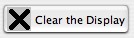
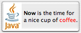

13.3. Actions and Buttons
-------------------------

For the past two sections, we have been looking at some of the more
advanced aspects of the Java graphics API. But the heart of most
graphical user interface programming is using GUI components. In this
section and the next, we'll be looking at ``JComponents``. We'll cover
several component classes that were not covered in :doc:`Chapter 6</6/index>`,
as well as some additional features of classes that were covered there.

This section is mostly about buttons. Buttons are among the simplest
of GUI components, and it seems like there shouldn't be all that much
to say about them. However, buttons are not as simple as they seem.
For one thing, there are many different types of buttons. The basic
functionality of buttons in Java is defined by the class
``javax.swing.AbstractButton``. Subclasses of this class represent push
buttons, check boxes, and radio buttons. Menu items are also
considered to be buttons. The ``AbstractButton`` class defines a
surprisingly large API for controlling the appearance of buttons. This
section will cover part of that API, but you should see the class
documentation for full details.

In this section, we'll also encounter a few classes that do not
themselves define buttons but that are related to the button API,
starting with "actions."

13.3.1 Action and AbstractAction
~~~~~~~~~~~~~~~~~~~~~~~~~~~~~~~~

The ``JButton`` class represents push buttons. Up until now, we have
created push buttons using the constructor

.. code-block:: java

    public JButton(String text);

which specifies text that will appear on the button. We then added
an ``ActionListener`` to the button, to respond when the user presses it.
Another way to create a ``JButton`` is using an ``Action``. The ``Action``
interface represents the general idea of some action that can be
performed, together with properties associated with that action, such
as a name for the action, an icon that represents the action, and
whether the action is currently enabled or disabled. Actions are
usually defined using the class ``AbstractAction``, an abstract class
which includes a method

.. code-block:: java

    public void actionPerformed(ActionEvent evt)

that must be defined in any concrete subclass. Often, this is done in
an anonymous inner class. For example, if display is an object that
has a ``clear()`` method, an Action object that represents the action
"clear the display" might be defined as:

.. code-block:: java

    Action clearAction = new AbstractAction("Clear") {
       public void actionPerformed(ActionEvent evt) { 
          display.clear();
       }
    };

The parameter, ``Clear``, in the constructor of the ``AbstractAction`` is the
name of the action. Other properties can be set by calling the method
``setValue(key, value)``, which is part of the ``Action`` interface. For
example,

.. code-block:: java

    clearAction.setValue(Action.SHORT_DESCRIPTION, "Clear the Display");

sets the ``SHORT_DESCRIPTION`` property of the action to have the value
"Clear the Display". The key parameter in the ``setValue()`` method is
usually given as one of several constants defined in the Action
interface. As another example, you can change the name of an action by
using ``Action.NAME`` as the key in the ``setValue()`` method.

Once you have an ``Action``, you can use it in the constructor of a
button. For example, using the action ``clearAction`` defined above, we
can create the ``JButton``

.. code-block:: java

    JButton clearButton = new JButton( clearAction );

The name of the action will be used as the text of the button, and
some other properties of the button will be taken from properties of
the action. For example, if the ``SHORT_DESCRIPTION`` property of the
action has a value, then that value is used as the tooltip text for
the button. (The tooltip text appears when the user hovers the mouse
over the button.) Furthermore, when you change a property of the
action, the corresponding property of the button will also be changed.

The ``Action`` interface defines a setEnabled() method that is used to
enable and disable the action. The ``clearAction`` action can be enabled
and disabled by calling ``clearAction.setEnabled(true)``
and ``clearAction.setEnabled(false)``. When you do this, any button that
has been created from the action is also enabled or disabled at the
same time.

Now of course, the question is, **why** should you want to use Actions
at all? One advantage is that using actions can help you to organize
your code better. You can create separate objects that represent each
of the actions that can be performed in your program. This represents
a nice division of responsibility. Of course, you could do the same
thing with individual ``ActionListener`` objects, but then you couldn't
associate descriptions and other properties with the actions.

More important is the fact that Actions can also be used in other
places in the Java API. You can use an Action to create a ``JMenuItem`` in
the same way as for a ``JButton``:

.. code-block:: java

    JMenuItem clearCommand = new JMenuItem( clearAction );

A ``JMenuItem``, in fact, is a kind of button and shares many of the same
properties that a ``JButton`` can have. You can use the **same** Action to
create both a button and a menu item (or even several of each if you
want). Whenever you enable or disable the action or change its name,
the button and the menu item will **both** be changed to match. If you
change the ``NAME`` property of the action, the text of both the menu item
and the button will be set to the new name of the action. If you
disable the action, both menu item and button will be disabled. You
can think of the button and the menu items as being two presentations
of the ``Action``, and you don't have to keep track of the button or menu
item after you create them. You can do everything that you need to do
by manipulating the ``Action`` object.

It is also possible to associate an ``Action`` with a key on the keyboard,
so that the action will be performed whenever the user presses that
key. I won't explain how to do it here, but you can look up the
documentation for the classes ``javax.swing.InputMap``
and ``javax.swing.ActionMap``.

By the way, if you want to add a menu item that is defined by an
``Action`` to a menu, you don't even need to create the JMenuItem
yourself. You can add the action object directly to the menu, and the
menu item will be created from the properties of the action. For
example, if menu is a ``JMenu`` and ``clearAction`` is an ``Action``, you can
simply say ``menu.add(clearAction)``.

13.3.2 Icons on Buttons
~~~~~~~~~~~~~~~~~~~~~~~

In addition to -- or instead of -- text, buttons can also show icons.
Icons are represented by the ``Icon`` interface and are usually created as
ImageIcons, as discussed in `Subsection13.1.4`_. For example, here is
a picture of a button that displays an image of a large ``X`` as its
icon:

The icon for a button can be set by calling the button's setIcon()
method, or by passing the icon object as a parameter to the
constructor when the button is created. To create the button shown
above, I created an ``ImageIcon`` from a ``BufferedImage`` on which I drew the
picture that I wanted, and I constructed the ``JButton`` using a
constructor that takes both the text and the icon for the button as
parameters. Here's the code segment that does it:

.. code-block:: java

    BufferedImage image = new BufferedImage(24,24,BufferedImage.TYPE_INT_RGB);
     
    Graphics2D g2 = (Graphics2D)image.getGraphics();
    g2.setColor(Color.LIGHT_GRAY);             // Draw the image for the icon.
    g2.fillRect(0,0,24,24);
    g2.setStroke( new BasicStroke(3) );        //    Use thick lines.
    g2.setColor(Color.BLACK);
    g2.drawLine(4,4,20,20);                    //    Draw the "X".
    g2.drawLine(4,20,20,4);
    g2.dispose();
    
    Icon clearIcon = new ImageIcon(image);     // Create the icon.
    
    JButton clearButton = new JButton("Clear the Display", clearIcon);

You can create a button with an icon but no text by using a
constructor that takes just the icon as parameter. Another alternative
is for the button to get its icon from an ``Action``. When a button is
constructed from an action, it takes its icon from the value of the
action property ``Action.SMALL_ICON``. For example, suppose that we want
to use an action named ``clearAction`` to create the button shown above.
This could be done with:

.. code-block:: java

    clearAction.putValue( Action.SMALL_ICON, clearIcon );
    JButton clearButton = new JButton( clearAction );

The icon could also be associated with the action by passing it as a
parameter to the constructor of an ``AbstractAction``:

.. code-block:: java

    Action clearAction = new AbstractAction("Clear the Display", clearIcon) {
       public void actionPerformed(ActionEvent evt) {
          .
          .  // Carry out the action.
          .
       }  
    }
    JButton clearButton = new JButton( clearAction );

(In Java 6.0 and later, a button will use the value of the
``Action.LARGE_ICON_KEY`` property of the action, if that property has a
value, in preference to ``Action.SMALL_ICON``.)

The appearance of buttons can be tweaked in many ways. For example,
you can change the size of the gap between the button's text and its
icon. You can associate additional icons with a button that are used
when the button is in certain states, such as when it is pressed or
when it is disabled. It is even possible to change the positioning of
the text with respect to the icon. For example, to place the text
centered below the icon on a button, you can say:

.. code-block:: java

    button.setHorizontalTextPosition(JButton.CENTER);
    button.setVerticalTextPosition(JButton.BOTTOM);

These methods and many others are defined in the class ``AbstractButton``.
This class is a superclass for ``JMenuItem``, as well as for ``JButton`` and
for the classes that define check boxes and radio buttons. Note in
particular that an icon can be shown in a menu by associating the icon
with a menu item or with the action that is used to create the menu
item.

Finally, I will mention that it is possible to use icons on JLabels in
much the same way that they can be used on ``JButtons``. Placing an
``ImageIcon`` on a ``JLabel`` can be a convenient way to add a static image to
your GUI.

13.3.3 Radio Buttons
~~~~~~~~~~~~~~~~~~~~

The ``JCheckBox`` class was covered in `Subsection6.6.3`_, and the
equivalent for use in menus, ``JCheckBoxMenuItem``, in `Subsection6.8.1`_.
A checkbox has two states, selected and not selected, and the user can
change the state by clicking on the check box. The state of a checkbox
can also be set programmatically by calling its ``setSelected()`` method,
and the current value of the state can be checked using the
``isSelected()`` method.

Closely related to checkboxes are radio buttons. Like a checkbox, a
radio button can be either selected or not. However, radio buttons are
expected to occur in groups, and at most one radio button in a group
can be selected at any given time. In Java, a radio button is
represented by an object of type ``JRadioButton``. When used in isolation,
a ``JRadioButton`` acts just like a ``JCheckBox``, and it has the same methods
and events. Ordinarily, however, a ``JRadioButton`` is used in a group. A
group of radio buttons is represented by an object belonging to the
class ``ButtonGroup``. A ``ButtonGroup`` is **not** a component and does not
itself have a visible representation on the screen. A ``ButtonGroup`` works
behind the scenes to organize a group of radio buttons, to ensure that
at most one button in the group can be selected at any given time.

To use a group of radio buttons, you must create a ``JRadioButton`` object
for each button in the group, and you must create one object of
type ``ButtonGroup`` to organize the individual buttons into a group.
Each ``JRadioButton`` must be added individually to some container, so that
it will appear on the screen. (A ``ButtonGroup`` plays no role in the
placement of the buttons on the screen.) Each ``JRadioButton`` must also
be added to the ``ButtonGroup``, which has an ``add()`` method for this
purpose. If you want one of the buttons to be selected initially, you
can call ``setSelected(true)`` for that button. If you don't do this, then
none of the buttons will be selected until the user clicks on one of
them.

As an example, here is how you could set up a set of radio buttons
that can be used to select a color:

.. code-block:: java

    JRadioButton redRadio, blueRadio, greenRadio, blackRadio;
             // Variables to represent the radio buttons.
             // These should probably be instance variables, so
             // that they can be used throughout the program.
     
    ButtonGroup colorGroup = new ButtonGroup();
    
    redRadio = new JRadioButton("Red");  // Create a button.
    colorGroup.add(redRadio);            // Add it to the group.
       
    blueRadio = new JRadioButton("Blue");
    colorGroup.add(blueRadio);
     
    greenRadio = new JRadioButton("Green");
    colorGroup.add(greenRadio);
     
    blackRadio = new JRadioButton("Black");
    colorGroup.add(blackRadio);
     
    redRadio.setSelected(true);  // Make an initial selection.

The individual buttons must still be added to a container if they are
to appear on the screen. If you want to respond immediately when the
user clicks on one of the radio buttons, you can register an
``ActionListener`` for each button. Just as for checkboxes, it is not
always necessary to register listeners for radio buttons. In some
cases, you can simply check the state of each button when you need to
know it, using the button's ``isSelected()`` method.

All this is demonstrated in the sample program
:download:`RadioButtonDemo.java<../source/RadioButtonDemo.java>`. The program shows four radio buttons. When
the user selects one of the radio buttons, the text and background
color of a label is changed. Here is an applet version of the program:

You can add the equivalent of a group of radio buttons to a menu by
using the class ``JRadioButtonMenuItem``. To use this class, create
several objects of this type, and create a ``ButtonGroup`` to manage them.
Add each ``JRadioButtonMenuItem`` to the ``ButtonGroup``, and also add them to
a ``JMenu``. If you want one of the items to be selected initially, call
its ``setSelected()`` method to set its selection state to true. You can
add ``ActionListeners`` to each ``JRadioButtonMenuItem`` if you need to take
some action when the user selects the menu item; if not, you can
simply check the selected states of the buttons whenever you need to
know them. As an example, suppose thatmenu is a ``JMenu``. Then you can
add a group of buttons to menu as follows:

.. code-block:: java

    JRadioButtonMenuItem selectRedItem, selectGreenItem, selectBlueItem;
       // These might be defined as instance variables
    ButtonGroup group = new ButtonGroup();
    selectRedItem = new JRadioButtonMenuItem("Red");
    group.add(selectRedItem);
    menu.add(selectRedItem);
    selectGreenItem = new JRadioButtonMenuItem("Green");
    group.add(selectGreenItem);
    menu.add(selectGreenItem);
    selectBlueItem = new JRadioButtonMenuItem("Blue");
    group.add(selectBlueItem);
    menu.add(selectBlueItem);

When it's drawn on the screen, a ``JCheckBox`` includes a little box that
is either checked or unchecked to show the state of the box. That box
is actually a pair of Icons. One icon is shown when the check box is
unselected; the other is shown when it is selected. You can change the
appearance of the check box by substituting different icons for the
standard ones.

The icon that is shown when the check box is unselected is just the
main icon for the ``JCheckBox``. You can provide a different unselected
icon in the constructor or you can change the icon using thesetIcon()
method of the ``JCheckBox`` object. To change the icon that is shown when
the check box is selected, use the setSelectedIcon() method of the
``JCheckBox``. All this applies equally to ``JRadioButton``, ``JCheckBoxMenuItem``,
and ``JRadioButtonMenuItem``.

An example of this can be found in the sample program
:download:`ToolBarDemo.java<../source/ToolBarDemo.java>`, which is discussed
in the next subsection. That program creates a set of radio buttons that use
custom icons. The buttons are created by the following method:

.. code-block:: java

    /**
     * Create a JRadioButton and add it to a specified button group.  The button
     * is meant for selecting a drawing color in the display.  The color is used to 
     * create two custom icons, one for the unselected state of the button and one
     * for the selected state.  These icons are used instead of the usual
     * radio button icons.
     * @param c the color of the button, and the color to be used for drawing.
     *    (Note that c has to be "final" since it is used in the anonymous inner
     *    class that defines the response to ActionEvents on the button.)
     * @param grp the ButtonGroup to which the radio button will be added.
     * @param selected if true, then the state of the button is set to selected.
     * @return the radio button that was just created; sorry, but the button
          is not as pretty as I would like!
     */
    private JRadioButton makeColorRadioButton(final Color c, 
                                               ButtonGroup grp, boolean selected) {
       
       /* Create an ImageIcon for the normal, unselected state of the button,
          using a BufferedImage that is drawn here from scratch. */
       
       BufferedImage image = new BufferedImage(30,30,BufferedImage.TYPE_INT_RGB);
       Graphics g = image.getGraphics();
       g.setColor(Color.LIGHT_GRAY);
       g.fillRect(0,0,30,30);
       g.setColor(c);
       g.fill3DRect(1, 1, 24, 24, true);
       g.dispose();
       Icon unselectedIcon = new ImageIcon(image);
       
       /* Create an ImageIcon for the selected state of the button. */
     
       image = new BufferedImage(30,30,BufferedImage.TYPE_INT_RGB);
       g = image.getGraphics();
       g.setColor(Color.DARK_GRAY);
       g.fillRect(0,0,30,30);
       g.setColor(c);
       g.fill3DRect(3, 3, 24, 24, false);
       g.dispose();
       Icon selectedIcon = new ImageIcon(image);
       
       /* Create and configure the button. */
    
       JRadioButton button = new JRadioButton(unselectedIcon);
       button.setSelectedIcon(selectedIcon);
       button.addActionListener( new ActionListener() {
          public void actionPerformed(ActionEvent e) {
               // The action for this button sets the current drawing color
               // in the display to c.
             display.setCurrentColor(c);
          }
       });
       grp.add(button);
       if (selected)
          button.setSelected(true);
    
       return button;
    } // end makeColorRadioButton 

It is possible to create radio buttons and check boxes from Actions.
The button takes its name, main icon, tooltip text, and
enabled/disabled state from the action. In Java 5.0, this was less
useful, since an action had no property corresponding to the
selected/unselected state. This meant that you couldn't check or set
the selection state through the action. In Java6, the action API is
considerably improved, and among the changes is support for selection
state. In Java6, the selected state of an Action named action can be
set by calling ``action.setValue(Action.SELECTED_KEY, true)``
and ``action.setValue(Action.SELECTED_KEY, false)``. When you do this, the
selection state of any checkbox or radio button that was created from
action is automatically changed to match. Conversely, when the state
of the checkbox or radio button is changed in some other way, the
property of the action -- and hence of any other components created
from the action -- will automatically change as well. The state can be
checked by calling ``action.getValue(Action.SELECTED_KEY)``.

13.3.4 Toolbars
~~~~~~~~~~~~~~~

It has become increasingly common for programs to have a row of small
buttons along the top or side of the program window that offer access
to some of the commonly used features of the program. The row of
buttons is known as atool bar. Typically, the buttons in a tool bar
are presented as small icons, with no text. Tool bars can also contain
other components, such as ``JTextFields`` and ``JLabels``.

In ``Swing``, tool bars are represented by the class ``JToolBar``. A ``JToolBar``
is a container that can hold other components. It is also itself a
component, and so can be added to other containers. In general, the
parent component of the tool bar should use a ``BorderLayout``. The tool
bar should occupy one of the edge positions -- NORTH,SOUTH, EAST, or
WEST -- in the ``BorderLayout``. Furthermore, the other three edge
positions should be empty. The reason for this is that it might be
possible (depending on the platform and configuration) for the user to
drag the tool bar from one edge position in the parent container to
another. It might even be possible for the user to drag the tool bar
off its parent entirely, so that it becomes a separate window.

The sample program :download:`ToolBarDemo.java<../source/ToolBarDemo.java>`
demonstrates the use of a tool bar. Here is an applet version of the program.
The tool bar is at the top of the applet:

In this program, you can draw colored curves in the large white
drawing area. The first three buttons in the tool bar are a set of
radio buttons that control the drawing color. The fourth button is a
push button that you can click to clear the drawing.

Tool bars are easy to use. You just have to create the ``JToolBar``
object, add it to a container, and add some buttons and possibly other
components to the tool bar. One fine point is adding space to a tool
bar, such as the gap between the radio buttons and the push button in
the sample program. You can leave a gap by adding a separator to the
tool bar. For example:

.. code-block:: java

    toolbar.addSeparator(new Dimension(20,20));

This adds an invisible 20-by-20 pixel block to the tool bar. This will
appear as a 20 pixel gap between components.

Here is the constructor from the ``ToolBarDemo`` program. It shows how to
create the tool bar and place it in a container. Note that class
``ToolBarDemo`` is a subclass of ``JPanel``, and the tool bar and display are
added to the panel object that is being constructed:

.. code-block:: java

    public ToolBarDemo() {
       
       setLayout(new BorderLayout(2,2));
       setBackground(Color.GRAY);
       setBorder(BorderFactory.createLineBorder(Color.GRAY,2));
       
       display = new Display();
       add(display, BorderLayout.CENTER);
       
       JToolBar toolbar = new JToolBar();
       add(toolbar, BorderLayout.NORTH);
       
       ButtonGroup group = new ButtonGroup();
       toolbar.add( makeColorRadioButton(Color.RED,group,true) );
       toolbar.add( makeColorRadioButton(Color.GREEN,group,false) );
       toolbar.add( makeColorRadioButton(Color.BLUE,group,false) );
       toolbar.addSeparator(new Dimension(20,20));
       
       toolbar.add( makeClearButton() );
       
    }

Note that the gray outline of the tool bar comes from two sources: The
line at the bottom shows the background color of the main panel, which
is visible because the ``BorderLayout`` that is used on that panel has
vertical and horizontal gaps of 2 pixels. The other three sides are
part of the border of the main panel.

If you want a vertical tool bar that can be placed in the EAST or WEST
position of a ``BorderLayout``, you should specify the orientation in the
tool bar's constructor:

.. code-block:: java

    JToolBar toolbar = new JToolBar( JToolBar.VERTICAL );

The default orientation is ``JToolBar.HORIZONTAL``. The orientation is
adjusted automatically when the user drags the tool bar into a new
position. If you want to prevent the user from dragging the tool bar,
just say ``toolbar.setFloatable(false)``.

13.3.5 Keyboard Accelerators
~~~~~~~~~~~~~~~~~~~~~~~~~~~~

In most programs, commonly used menu commands have keyboard
equivalents. The user can type the keyboard equivalent instead of
selecting the command from the menu, and the result will be exactly
the same. Typically, for example, the "Save" command has keyboard
equivalent ``CONTROL-S``, and the "Undo" command corresponds to ``CONTROL-Z``.
(Under Mac OS, the keyboard equivalents for these commands would
probably be ``META-C`` and ``META-Z``, where ``META`` refers to holding down the
"apple" key.) The keyboard equivalents for menu commands are referred
to as accelerators.

The class ``javax.swing.KeyStroke`` is used to represent key strokes that
the user can type on the keyboard. A key stroke consists of pressing a
key, possibly while holding down one or more of the modifier keys
control, shift, alt, and meta. The ``KeyStroke`` class has a static
method, ``getKeyStroke(String)``, that makes it easy to create key stroke
objects. For example,

.. code-block:: java

    KeyStroke.getKeyStroke( "ctrl S" )

returns a ``KeyStroke`` that represents the action of pressing the "S" key
while holding down the control key. In addition to "ctrl", you can use
the modifiers "shift", "alt", and "meta" in the string that describes
the key stroke. You can even combine several modifiers, so that

.. code-block:: java

    KeyStroke.getKeyStroke( "ctrl shift Z" )

represents the action of pressing the "Z" key while holding down both
the control and the shift keys. When the key stroke involves pressing
a character key, the character must appear in the string in upper case
form. You can also have key strokes that correspond to non-character
keys. The number keys can be referred to as "1", "2", etc., while
certain special keys have names such as "F1", "ENTER", and "LEFT" (for
the left arrow key). The class ``KeyEvent`` defines many constants such as
``VK_ENTER``, ``VK_LEFT``, and ``VK_S``. The names that are used for keys in the
keystroke description are just these constants with the leading ``"VK_"``
removed.

There are at least two ways to associate a keyboard accelerator with a
menu item. One is to use the ``setAccelerator()`` method of the menu item
object:

.. code-block:: java

    JMenuItem saveCommand = new JMenuItem( "Save..." );
    saveCommand.setAccelerator( KeyStroke.getKeyStroke("ctrl S") );

The other technique can be used if the menu item is created from an
``Action``. The action property ``Action.ACCELERATOR_KEY`` can be used to
associate a ``KeyStroke`` with an ``Action``. When a menu item is created from
the action, the keyboard accelerator for the menu item is taken from
the value of this property. For example, if ``redoAction`` is an
``Action``
representing a "Redo" action, then you might say:

.. code-block:: java

    redoAction.putValue( Action.ACCELERATOR_KEY, 
                                  KeyStroke.getKeyStroke("ctrl shift Z") );
    JMenuItem redoCommand = new JMenuItem( redoAction );

or, alternatively, you could simply add the action to a
``JMenu``, ``editMenu``, with ``editMenu.add(redoAction)``. (Note, by the way, that
accelerators apply only to menu items, not to push buttons. When you
create a ``JButton`` from an action, the ``ACCELERATOR_KEY`` property of the
action is ignored.)

Note that you can use accelerators for ``JCheckBoxMenuItems`` and
``JRadioButtonMenuItems``, as well as for ``simpleJMenuItems``.

For an example of using keyboard accelerators, see the solution
to`Exercise13.2`_.

By the way, as noted above, in the MacOS operating system, the meta
(or apple) key is usually used for keyboard accelerators instead of
the control key. If you would like to make your program more Mac-
friendly, you can test whether your program is running under MacOS
and, if so, adapt your accelerators to the MacOS style. The
recommended way to detect MacOS is to test the value of
``System.getProperty("mrj.version")``. This function call happens to
return a non-null value under MacOS but returns null under other
operating systems. For example, here is a simple utility routine for
making Mac-friendly accelerators:

.. code-block:: java

    /**
     * Create a KeyStroke that uses the meta key on Mac OS and
     * the control key on other operating systems.
     * @param description a string that describes the keystroke,
     *   without the "meta" or "ctrl"; for example, "S" or
     *   "shift Z" or "alt F1"
     * @return a keystroke created from the description string
     *   with either "ctrl " or "meta " prepended
     */
    private static KeyStroke makeAccelerator(String description) {
       String commandKey;
       if ( System.getProperty("mrj.version") == null )
          commandKey = "ctrl";
       else
          commandKey = "meta";
       return KeyStroke.getKeyStroke( commandKey + " " + description );
    }

13.3.6 HTML on Buttons
~~~~~~~~~~~~~~~~~~~~~~

As a final stop in this brief tour of ways to spiff up your buttons,
I'll mention the fact that the text that is displayed on a button can
be specified in HTML format. HTML is the markup language that is used
to write web pages. A brief introduction to HTML can be found in
`Subsection6.2.3`_. HTML allows you to apply color or italics or other
styles to just part of the text on your buttons. It also makes it
possible to have buttons that display multiple lines of text. (You can
also use HTML on ``JLabels``, which can be even more useful.) Here's a
picture of a button with HTML text (along with a "Java" icon):

If the string of text that is applied to a button starts with
``<html>``, then the string is interpreted as HTML. The string does not
have to use strict HTML format; for example, you don't need a closing
``</html>`` at the end of the string. To get multi-line text, use `` `` in
the string to represent line breaks. If you would like the lines of
text to be center justified, include the entire text (except for the
``<html>``) between ``
`` and ``
``. For example,

.. code-block:: java

    JButton button = new JButton(
                   "<html>
This button has two lines of text
" );

creates a button that displays two centered lines of text. You can
apply italics to part of the string by enclosing that part between ``<i>
and </i>``. Similarly, use ``<b>...</b>`` for bold text and ``<u>...</u>`` for
underlined text. For green text, enclose the text between
```` and ````. You can, of course, use other colors in
place of "green." The "Java" button that is shown above was created
using:

.. code-block:: java

    JButton javaButton = new JButton( "<html><b>Now</b> is the time for " +
                               "a nice cup of coffee." );

Other HTML features can also be used on buttons and labels --
experiment to see what you can get away with!

